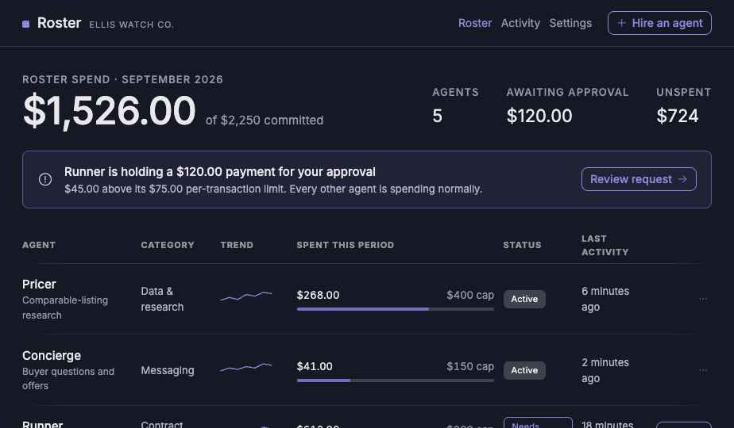
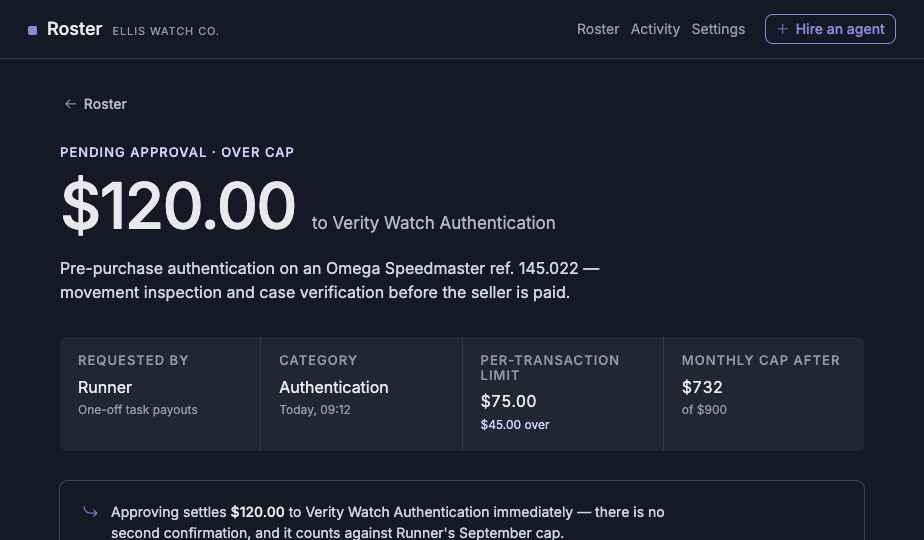

# Roster — Product Requirements Document
**Manage a team of AI agents the way you'd manage real employees**

*Version 0.2 (draft) · 8 September 2026 · Owner: Chris*

> "Roster" is a working title. Rename freely — this document tracks the product, not the name.

---

## 1. Summary

A solo founder or small business owner "hires" AI agents onto a roster the same way they'd bring on contractors: each agent gets a role, a budget, and limits on what it can spend without asking. Agents draw against their budget autonomously for routine spend. Anything unusual — over budget, outside their role — goes to the owner for approval, the same way an unusual expense report would. The owner can suspend or terminate any agent's access instantly.

**One line:** *"Give every AI agent on your small team a budget and a role, the way you'd onboard an employee — enforced by a contract, not a policy."*

**Positioning note:** this is a financial control and enforcement layer for a solo founder's or small business owner's own agent team — not an IT department's tool for discovering agent sprawl across a large organisation, and not a general task/workflow orchestration platform.

## 2. Problem

A solo founder or small business owner running more than one AI agent as their working team has no structural way to say "this agent can spend up to $X on Y kind of thing, and no more," enforced at the moment of payment rather than discovered afterward in a bill or a log.

Today, enforcement happens one of two weak ways: a human confirms every payment — which defeats the point of autonomy and, at the volumes agent payments actually run at, is genuinely uneconomical (a 5–15 second wallet confirmation on each of roughly 2.9 million monthly agent transactions industry-wide adds up to an estimated 4,000–12,000 user-hours of approval friction per month) — or a platform "watches" spend and flags overages after the fact, which is governance by observation, not prevention.

Tools built for the solo-founder "agent company" audience already recognise that financial actions need a human approval gate — that's stated as a design principle in tools like Alook. But it's a stated principle, not an enforced guarantee. Separately, enterprise agent-governance tools (Microsoft's Agent 365, IBM's agentic control plane) solve a different problem for a different buyer entirely.

As a solo owner adds more agents to their own team, managing this manually doesn't scale any better than it did for a single agent, and gets worse per agent added.

## 3. Why now

- **Payment execution infrastructure is real and standardising fast.** x402 processed roughly 165 million agent transactions by April 2026 and was formalised under the Linux Foundation the same month, with Circle, Google, Mastercard, Microsoft, Stripe, and Visa as launch members. Stripe/Tempo's MPP protocol is a real part of the same landscape, but its confirmed settlement path is Tempo, not Arc — this build standardises on x402 specifically. MPP support is not a goal; don't reintroduce it without confirming an Arc-specific settlement path first.
- **Transaction values are still small** — roughly $0.14–0.30 on average — which means the enforcement mechanism has to work at agent scale, not human-approval scale.
- **The governance gap is real and quantified.** Gartner projects over 40% of agentic AI projects will be cancelled by the end of 2027, citing escalating costs and inadequate risk controls; only 21% of organisations currently have a mature governance model.
- **Industry framing already treats agents as employee-shaped** — identity, permissions, a spending budget, an operational scope, approval gates. Roster takes that framing literally for the one layer still missing.
- **The "solo founder runs a team of agents" pattern is real**, documented under names like "one-person company" and "agent company." Tools for this buyer state that financial actions need approval; none enforce it with a hard, contract-guaranteed limit.

## 4. The asset menu

| Leg | Asset | Role |
|---|---|---|
| Cash | USDC | What agents pay with, native gas asset on Arc |

Crypto-only for this build, by decision. A fiat version requires a bank or card network to enforce the limit — a partnership problem, not a code problem — so it's out of scope.

## 5. Solution

| Employee concept | Mechanism |
|---|---|
| **Hiring** | Owner registers an agent's address and sets its per-transaction and per-period caps in one signature. |
| **Job role** | A label/category on the agent's allowance — informs dashboard grouping, adds no contract logic. |
| **Payroll** | Scheduled, recurring replenishment of an agent's period budget. |
| **Autonomous work** | The agent calls a payment function directly, structured as an x402-compatible endpoint. The contract checks both caps before releasing funds. |
| **Performance review / expense report** | If either cap is exceeded, the payment moves to a pending state. The owner sees what it's for, how much, and to whom. |
| **Termination** | The owner can revoke or reduce any single agent's allowance at any time, with zero effect on any other agent. |
| **Team roster** | A dashboard listing every agent under one owner: role, budget status, recent activity. |

## 6. User stories

- **As a business owner**, I want to bring a new AI agent onto my roster with a role and a budget in one step. *Accepts when:* I set caps and role once; it appears on my roster and can draw immediately.
- **As a business owner**, I want to see my whole team of agents in one view. *Accepts when:* the dashboard shows every agent's status without checking each one.
- **As an AI agent**, I want to spend within my role's budget without asking permission each time. *Accepts when:* in-budget spend executes immediately; anything over cap holds pending with the reason visible.
- **As a business owner**, I want to remove an agent instantly if something goes wrong. *Accepts when:* revoking one agent has no effect on any other.

## 7. Demo narrative

Chris runs a one-person business buying and reselling luxury watches. Three agents handle it.

1. Owner "hires" three agents onto the roster:
   - a **pricing agent** ($10/txn, $100/week, role "market research") — comparable listings via **Brave Search** and **Exa**.
   - a **support agent** ($5/txn, $50/week, role "buyer support") — routine buyer questions via **Groq**.
   - a **fulfillment agent** ($75/txn, $400/week, role "authentication & logistics") — hires real people for one-off tasks via **molty.cash**.
2. All three appear on the roster dashboard with role, budget, and status.
3. The pricing and support agents make several small autonomous payments, visible live.
4. The fulfillment agent tries to hire an authenticator for a $120 pre-purchase inspection — over its per-transaction cap. It holds pending, flagged with what it's for and who it would pay.
5. Chris reviews and approves it directly from the roster view.
6. Chris terminates the support agent's access on the spot; its next attempted payment is refused while the other two continue unaffected — proving isolation, not just that revocation works.

**Roster overview** — the screen Chris sees day to day:

**Pending approval** — the screen that appears the moment the fulfillment agent's $120 request exceeds its cap:

Also in `docs/mockups/`: the hire-an-agent modal and the full activity log. `docs/mockups/README.md`
transcribes all four and lists five discrepancies between these mockups and this document that need
resolving before checkpoint 8.

## 8. Functional requirements

| Description | Priority |
|---|---|
| **Agent onboarding** — register an agent address with both caps and a role label, in one step. | Must have |
| **Per-transaction cap enforcement** — rejected by the contract at execution time. | Must have |
| **Per-period cap enforcement & reset** — tracked per agent; resets automatically at period boundary. | Must have |
| **Autonomous payment execution** — funds release immediately if both caps satisfied, no owner signature. | Must have |
| **x402-compatible payment endpoint** — callable by any x402-aware agent framework. | Must have |
| **Above-cap pending state** — held, tagged with the agent, never silently dropped. | Must have |
| **Owner approval / rejection action** — view details and decide in one action. | Must have |
| **Per-agent kill switch** — revoke or reduce one agent, zero effect on others. | Must have |
| **Roster dashboard** — role, budget status, recent activity, pending items. | Must have |
| **Recurring allowance top-up ("payroll")** — via Unified Balance/Bridge Kit. | Nice to have |
| **Role/category labelling** — dashboard grouping only. | Nice to have |
| **Per-agent activity/audit feed** — real-time, filterable by agent. | Nice to have |
| **Agent identity binding** — allowance bound to a specific address. | Nice to have |
| **Bazantic / recipe exposure** — allowance-check wrapped for discovery. | Nice to have |

## 9. Scope

### In
- Per-transaction and per-period spend caps, per agent
- Autonomous agent-initiated payments within the allowance
- Above-cap pending state with owner approval/rejection
- Immediate, per-agent revocation, isolated from every other agent
- x402-compatible payment endpoint via Circle's Arc-testnet facilitator
- A roster dashboard across all of an owner's agents
- Single asset (USDC), single chain (Arc testnet) for enforcement
- Optional recurring "payroll" top-up per agent

**Explicitly excluded protocol:** MPP. Its confirmed settlement path today is Tempo, not Arc. Revisit only if an Arc-specific settlement path is confirmed.

### Out
**Against enterprise agent-governance tooling:** general AI governance (token/compute monitoring, prompt filtering, output validation); compliance reporting / AI BOM / regulatory audit tooling; agent-sprawl discovery.

**Against solo-founder workflow orchestration:** defining agent roles/tasks/handoffs beyond a free-text label; non-financial approval gates; org-chart features (hierarchy, delegation, agents managing agents); performance evaluation of output quality.

**Excluded regardless:** fiat rails; multi-signer/quorum approval; reputation- or trust-based credit for agents.

## 10. How Roster uses Arc

Deploys entirely on Arc testnet (chain id `5042002`). USDC is Arc's native gas asset, fees target ~$0.01/txn, finality sub-second.

| Arc / Circle component | What we're using it for |
|---|---|
| **Arc testnet** (`5042002`) | Deployment chain for the allowance contract |
| **USDC** (native gas asset, predeploy `0x3600…0000`) | The single asset every agent spends; one balance covers gas too |
| **Circle Agent Stack** | The framework the agent's payment tool is built against |
| **Circle's Arc-testnet x402 facilitator** | Verifies and settles the x402 payments, paired with Gateway for gasless settlement |
| **Circle Gas Station** | Sponsors gas for the owner's own transactions |
| **EntryPoint v0.7** (`0x0000…da032`) | Account-abstraction flow behind Gas Station sponsorship |
| **Circle Unified Balance / Bridge Kit** | Funding rail — owner funds from USDC held across chains |
| **Blockscout** (`/api/v2/` REST) | Powers the per-agent activity feed — no separate indexer |

**Deliberately not used:** raw CCTP (Bridge Kit already wraps it); Chainlink price feeds or any oracle (Roster never prices an asset).

## 11. Tracks and prizes

| Partner | Track | Prize | How Roster satisfies it |
|---|---|---|---|
| **Arc** | Best Agentic Economy Application with Circle Agent Stack | $1,667 | The core product is agents making autonomous, policy-bounded USDC payments |
| **Arc** | Best DeFi/Onchain Finance Application (fallback, same slot) | $1,667 | A spend-allowance contract is payments/treasury infrastructure |
| **Arc** | Launch on Arc Testnet & Push to Mainnet (same slot) | $3,500 | Funding via Unified Balance/Bridge Kit matches the track's own language |
| **Privy** | Best Financial Flow | $2,500 | One-time allowance setup authorizing ongoing autonomous draws |
| **Bazantic** | Help an Agent Use Your Hackathon Project | $1,000 | Allowance-check exposed as a discoverable recipe |

Arc's three tracks are alternatives within one slot, not stacked — realistically $3,500 from Arc plus $2,500 Privy plus $1,000 Bazantic.

**Sequencing:** build and confirm the core allowance mechanism and the x402 endpoint first — required for every track. Resolve the Circle Agent Stack question early. Bazantic is the cheapest addition and safest to leave for last.

## 12. Risks

| # | Risk |
|---|---|
| R1 | The employee framing invites two comparisons — enterprise governance tools and solo-founder orchestration tools. Name the buyer explicitly and state both boundaries early, before a judge asks. |
| R2 | Thin real-world transaction volume in the category today. Lean on the mechanism and the measured approval-friction problem. |
| R3 | x402 and ERC-8183 are early, draft-stage standards. Build against current specs without over-promising conformance. |
| R4 | The contract is the single point of enforcement and therefore a single point of failure. Keep it small and simple. |
| R5 | Three agents in one live take is more moving parts than one. Rehearse the per-agent isolation moment specifically. |

## 13. Open questions

1. Does Circle's Agent Stack have a testnet-ready SDK on Arc today, or does Agentic Economy eligibility only require the *shape* of the flow?
2. What does "agent identity" mean for the demo — a plain address, or ERC-8004?
3. Is three agents right for the demo, or does two make the isolation point with less live risk?
4. Does "payroll" make the demo meaningfully better, or is it the metaphor being cute? If it doesn't change what the demo proves, cut it.
