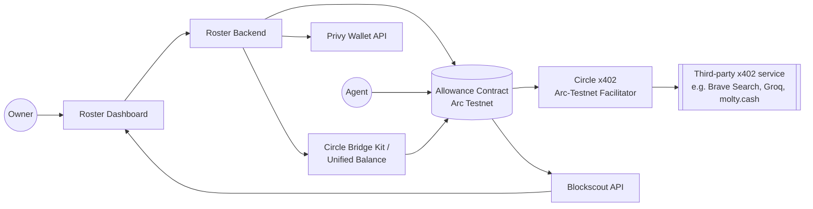
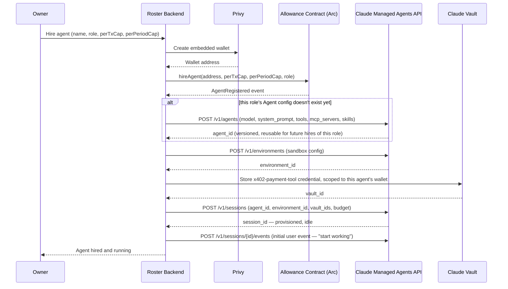
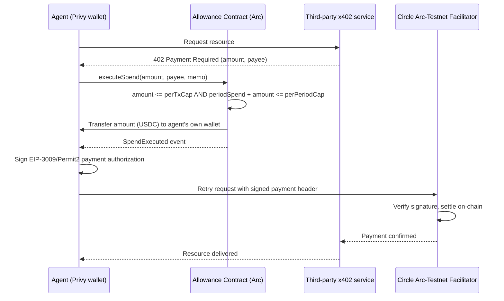
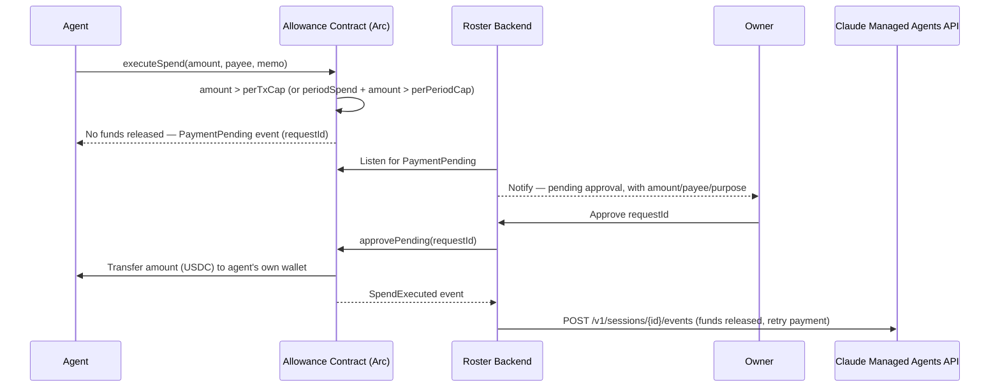
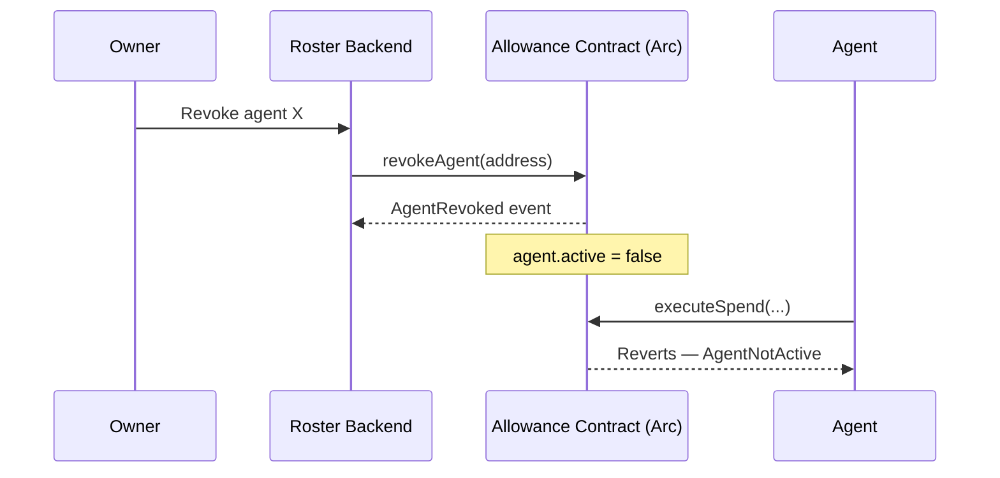
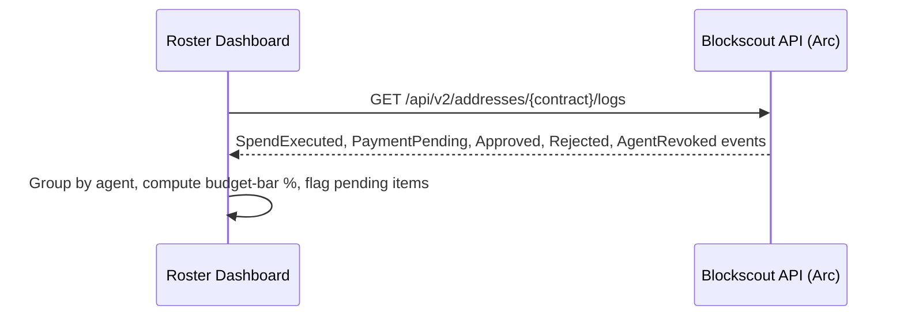
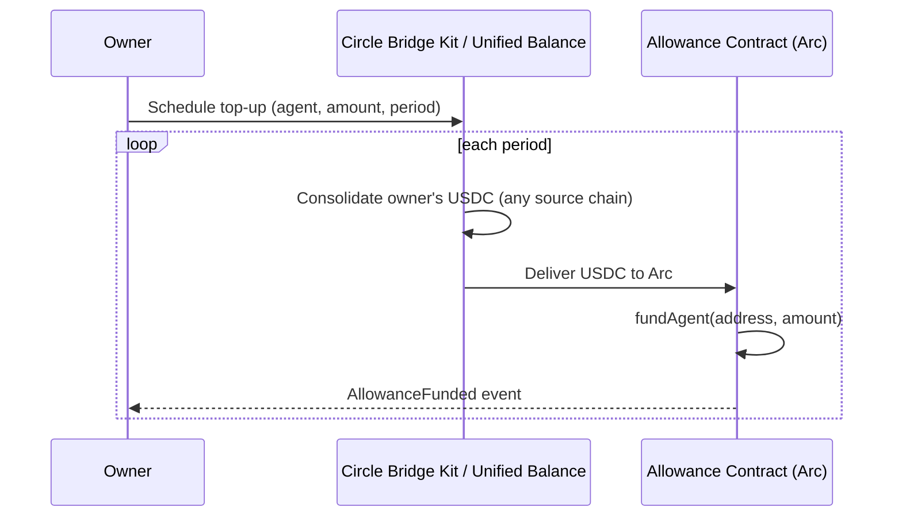

# Roster — Technical Design

*Version 0.1 (draft) · 8 September 2026 · Companion to PRD.md*

---

## 1. Background

Roster is a financial control layer for AI agents: a solo founder or small business owner registers each agent with a spending allowance (a per-transaction cap and a per-period cap), enforced on-chain. Agents draw against their allowance autonomously for anything inside those limits. Anything over either cap holds in a pending state until the owner approves or rejects it. The owner can revoke any single agent's access instantly, with no effect on the rest of the roster.

The system deploys entirely on **Arc testnet** (chain id `5042002`), settles agent payments via **x402** through Circle's Arc-testnet facilitator (MPP is explicitly out of scope — no confirmed Arc settlement path exists for it today), and provisions each agent's wallet automatically through **Privy**, so an owner never handles a private key or a raw address. Funding — both the owner's initial deposit and recurring "payroll" top-ups — can pull USDC from wherever the owner actually holds it via **Circle Unified Balance / Bridge Kit**, consolidating into Arc without a manual bridge step.

## 2. Requirements

| ID | Requirement |
|---|---|
| R1 | Owner can register a new agent with a role, a per-transaction cap, and a per-period cap, in one step, without entering an address |
| R2 | An agent's payment is rejected by the contract if it exceeds the per-transaction cap |
| R3 | An agent's cumulative spend is tracked against its per-period cap and resets automatically at the period boundary |
| R4 | An agent can call a payment function directly; funds release immediately with no owner signature if both caps are satisfied |
| R5 | The payment function is exposed as an x402-compatible endpoint, settled via Circle's Arc-testnet facilitator |
| R6 | A payment that exceeds either cap is held in a pending state — never silently dropped, never force-executed |
| R7 | Owner can view a pending request's amount, payee, and purpose, and approve or reject it in one action |
| R8 | Owner can revoke or reduce one agent's allowance at any time, with zero effect on any other agent |
| R9 | Owner can view every agent's role, budget status, and recent activity from a single dashboard |
| R10 | Owner can schedule a recurring allowance top-up for an agent, funded from USDC held on any chain, not just Arc |
| R11 | The allowance-check/payment endpoint is discoverable by external agent frameworks (Bazantic) |

### 2.1 Requirement → Mechanism map

| Requirement | Mechanism section |
|---|---|
| R1 | §4.1 Agent onboarding |
| R2, R3, R4, R5 | §4.2 Autonomous payment (within cap) |
| R6, R7 | §4.3 Above-cap payment → pending approval |
| R8 | §4.4 Revocation |
| R9 | §4.5 Dashboard & activity feed |
| R10 | §4.6 Funding & recurring top-up |
| R11 | §4.7 External discovery |

## 3. High-level overview

Five components own the system's behaviour:

- **Allowance Contract (Arc)** — the single source of truth for caps, pending state, and revocation. Every other component reads from or writes to it; nothing enforces a limit anywhere else.
- **Roster Backend** — the only component that talks to Privy and Bridge Kit. It never holds funds or signs payments on an agent's behalf; it only orchestrates provisioning and funding.
- **Privy** — mints a real wallet per agent with no manual key handling.
- **Circle's Arc-testnet x402 facilitator** — verifies and settles agent payments against real x402 services.
- **Blockscout** — the read layer. The dashboard never queries the contract directly for history; it reads Blockscout's indexed event log.

## 4. Mechanisms

### 4.1 Agent onboarding ("hire an agent")

Four-resource setup — **Agent** (behaviour: model, system prompt, tools, MCP servers, skills), **Environment** (the sandbox it runs in), **Vault** (credentials for any authenticated tool), and **Session** (the actual running instance) — plus the Privy wallet and Allowance Contract registration. All Managed Agents calls require the `managed-agents-2026-04-01` beta header and standard `x-api-key`/`anthropic-version` headers.

**Why Agent and Environment are separate from Session:** Agent and Environment are versioned, reusable resources — a "Pricing research agent" role only needs to be defined once, then every hire of that role reuses the same `agent_id`. A Session is the actual running instance tied to one specific hire: one wallet, one allowance, one vault credential.

**Two distinct caps, not one:** the `budget` object at session creation caps Claude's own token/compute spend for that session. This is separate from the Allowance Contract's per-transaction and per-period USDC caps — one bounds what the agent costs to run, the other bounds what it's allowed to pay out.

**Creating a session doesn't start work.** The backend still has to send a user event (or pass `initial_events`) to kick the agent into motion.

The owner never sees a wallet address or an agent ID. `hireAgent` is `onlyOwner`; the caller's identity is checked against the roster's owner, not against the new agent.

### 4.2 Autonomous payment, within cap

The contract is a treasury, not just a gate — it holds the USDC (funded via §4.6) and releases it to the agent's own wallet once the caps clear. The agent's wallet then does the actual x402 signing itself.

No owner signature anywhere in this path. `executeSpend` is `onlyAgent`.

**Timing matters.** `executeSpend` fires immediately before the agent retries the x402 request, not ahead of time as a batch top-up — that bounds the released-but-unspent window to a single request.

**Failure case: release succeeds but the x402 payment doesn't.** The USDC stays in the agent's wallet and counts against its period cap. Nothing reclaims it today — `sweepUnspent` was removed (see §5). The point-of-use release above is what keeps this bounded: at most one request's worth is ever stranded, rather than an accumulating balance. Reclaiming it needs an ERC-20 allowance from the agent's wallet, which §4.1's onboarding would have to establish first.

### 4.3 Above-cap payment → pending approval

Rejection follows the same shape via `rejectPending(requestId)` — request closed, no funds move, no session event.

**Why the backend sends the session event directly:** it already knows the `requestId`, agent, and session at the moment of the click. `SpendExecuted` also fires from §4.2's ordinary path, so inferring "this one came from an approval" from the event stream would need extra state-tracking.

### 4.4 Revocation (kill switch)

`revokeAgent` touches only that agent's record — isolation is a property of the storage layout (one struct per agent address), not application logic.

**What revocation does and doesn't cover.** It stops every *future* `executeSpend`, and it also blocks `approvePending` on any request that agent left outstanding — otherwise the kill switch would have a hole in it. It does not claw back USDC already released to that agent's wallet: the contract is non-custodial of funds once they've moved, and there is no sweep. What remains unearmarked stays in the treasury for the rest of the roster.

### 4.5 Dashboard & activity feed

No separate indexer.

### 4.6 Funding & recurring top-up ("payroll")

Bridge Kit's job ends the moment funds land on Arc.

### 4.7 External discovery (Bazantic)

The allowance-check used in §4.2 is exposed as a read-only recipe in Bazantic's registry, so an external agent framework can check whether a spend would clear before attempting it.

## Open technical questions

1. Does Circle's Agent Stack expose a testnet-ready SDK on Arc, or does §4.2's facilitator interaction need to be built against the raw x402 spec directly?
2. Does `executeSpend`'s `onlyAgent` check bind to a plain contract address, or does agent identity need to resolve through ERC-8004? *(Implemented as a plain address; ERC-8004 is on the backlog's cut list and nothing in the contract assumes either answer.)*

## 5. Smart contract functions

| Function signature | Access control | Purpose |
|---|---|---|
| `hireAgent(address agent, uint256 perTxCap, uint256 perPeriodCap, string calldata role)` | `onlyOwner` | Registers a new agent's wallet address, its two caps, and its role label. §4.1 |
| `initialize(address owner)` | Once, by the factory | Sets the owner. Replaces a constructor, which a minimal proxy cannot run. |
| `fundAgent(address agent, uint256 amount)` | `onlyOwner` | Earmarks USDC the Roster **already holds** for that agent. Moves no tokens. Reverts if the balance can't cover every earmark. §4.6 |
| `executeSpend(uint256 amount, address payee, bytes calldata memo) returns (bool executed, uint256 requestId)` | `onlyAgent` | Checks both caps. If satisfied, transfers `amount` to the agent's own wallet and returns `executed = true`. If not, opens a pending request. §4.2, §4.3 |
| `defundAgent(address agent, uint256 amount)` | `onlyOwner` | Returns an agent's earmark to the unallocated treasury. Counterpart to `fundAgent`. |
| `withdrawTreasury(address to, uint256 amount)` | `onlyOwner` | Moves unallocated USDC out. Bounded by `balance - totalEarmarked`, so it can never touch an earmark. |
| `approvePending(uint256 requestId)` | `onlyOwner` | Releases a held request's funds. §4.3 |
| `rejectPending(uint256 requestId)` | `onlyOwner` | Closes a held request with no funds moved. §4.3 |
| `revokeAgent(address agent)` | `onlyOwner` | Sets that agent's `active` flag false. Touches only that agent's record. §4.4 |
| `updateCaps(address agent, uint256 newPerTxCap, uint256 newPerPeriodCap)` | `onlyOwner` | Adjusts caps without a full revoke/re-hire (R8's "reduce" half). |
| `getAgent(address agent) view returns (AgentInfo memory)` | Public | Caps, role, active status, current period spend, earmarked balance. Applies the lazy reset to what it returns, so the period it reports is the one the next `executeSpend` will enforce. |
| `getPendingRequest(uint256 requestId) view returns (PendingRequest memory)` | Public | Amount, payee, memo, requesting agent. |
| `owner() / PERIOD_LENGTH() / totalEarmarked()` | Public | Owner, the fixed 30-day period, and the sum of every agent's earmark. |

**Note on period resets:** no `resetPeriod` function. `executeSpend` computes whether the current timestamp has crossed the agent's period boundary since its last recorded reset, and if so zeroes the period-spend counter before checking the cap. The period is a fixed `PERIOD_LENGTH = 30 days` for every agent on every Roster, not a per-agent field — see DECISIONS.md 2026-09-09. `periodStart` advances by whole periods, so an agent that goes quiet for three months does not get a fresh period beginning the moment it wakes up.

**Note on getting funds back out (added 2026-09-09).** `fundAgent` alone made an earmark a
one-way door: USDC delivered to the Roster but never earmarked was locked in it forever, and
revoking a funded agent stranded that agent's remaining budget permanently — which made the kill
switch cost real money. `defundAgent` and `withdrawTreasury` close both. The invariant they
preserve is `USDC.balanceOf(roster) >= totalEarmarked`: an agent always keeps what it was
promised, and only the surplus can leave.

**Note on `sweepUnspent`:** removed. It needed an ERC-20 allowance from the agent's wallet to the contract that §4.1's onboarding never established. Nothing reclaims released-but-unspent USDC today; the exposure is bounded to a single request by the point-of-use release in §4.2, which is what made the sweep optional in the first place. See DECISIONS.md 2026-09-09.

### 5.1 One Roster per team — `RosterFactory`

A Roster is one owner's team. `RosterFactory.createRoster(owner)` deploys each one as an EIP-1167 minimal proxy over a single implementation, so a new team costs a 45-byte deployment.

| Function | Purpose |
|---|---|
| `createRoster(address owner) returns (address)` | Deploy and initialize a Roster owned by `owner`. Permissionless. |
| `implementation()` | The shared Roster implementation. Locked at factory construction. |
| `rostersOf(address owner) / rosterCount() / rosterAt(uint256)` | Enumeration for the dashboard. |

**Deliberately not upgradeable.** The clones delegatecall a fixed implementation and no admin can swap it. R4 is that the contract is the single point of enforcement and therefore the single point of failure; an upgrade path adds a second way for the guarantee to fail — one an owner cannot audit by reading the code their agents are bound to.

Isolation now holds at two levels: between agents on one Roster (a storage-layout property, §4.4) and between teams (separate contracts, separate treasuries).

## 6. Backend endpoints

Owner-authenticated only. Agents never call these; an agent's payment tool talks to the contract and the x402 facilitator directly with its own wallet.

| Endpoint | Purpose |
|---|---|
| `POST /agents` | Hire a new agent — full §4.1 flow. |
| `GET /agents` | List every agent with role, budget status, last activity. |
| `GET /agents/{id}` | Single agent detail. |
| `PATCH /agents/{id}/caps` | Calls `updateCaps`. |
| `POST /agents/{id}/revoke` | Calls `revokeAgent`. §4.4 |
| `GET /agents/{id}/activity` | Per-agent feed, proxying Blockscout. §4.5 |
| `GET /pending` | All pending approval requests. |
| `POST /pending/{requestId}/approve` | Calls `approvePending`, then sends the Claude session event. §4.3 |
| `POST /pending/{requestId}/reject` | Calls `rejectPending`. |
| `POST /agents/{id}/fund` | One-off `fundAgent`. §4.6 |
| `POST /agents/{id}/defund` | Calls `defundAgent`. |
| `GET /treasury` | Earmarked, unallocated, and total balance. |
| `POST /treasury/withdraw` | Calls `withdrawTreasury`, always to the roster's owner. |
| `POST /agents/{id}/funding-schedule` | Recurring payroll top-up via Bridge Kit. §4.6 |

**Not an endpoint but backend infrastructure:** a persistent listener on the contract's event stream watching for `PaymentPending`.

## 7. Implementation checkpoints

| # | Checkpoint | Notes |
|---|---|---|
| 1 | Deploy the Allowance Contract to Arc testnet | All functions in §5, with unit tests covering cap math and lazy period-reset. Contract and factory written and tested 2026-09-09; deployment pending an RPC URL and a funded key. |
| 2 | Verify Circle's Arc-testnet x402 facilitator end-to-end | Against one real service, before building anything on top of it. |
| 3 | Wire Privy wallet creation | Owner and agents; confirm an agent wallet can sign `executeSpend` and a real x402 header. |
| 4 | Create the Claude Managed Agents resources | One Agent config per role, one Environment, `managed-agents-2026-04-01` header. |
| 5 | Build the agent's payment tool | Reads a 402, calls `executeSpend`, signs and retries. |
| 6 | Build the backend endpoints in §6 | Wired to Privy, contract, Claude API. |
| 7 | Build the `PaymentPending` listener and the two-step approve action | §4.3 |
| 8 | Build the UI | Hire form, roster overview, pending-approval detail. Mocked data first. |
| 9 | Wire overview + activity feed to live Blockscout data | §4.5 |
| 10 | Wire Bridge Kit / Unified Balance | §4.6 |
| 11 | End-to-end rehearsal of the demo narrative | Run it twice from a clean state. |
| 12 | Wrap the allowance-check as a Bazantic recipe | Lowest priority. §4.7 |
| 13 | Record the demo video | — |

Checkpoint 2 is the one to front-load hardest.
